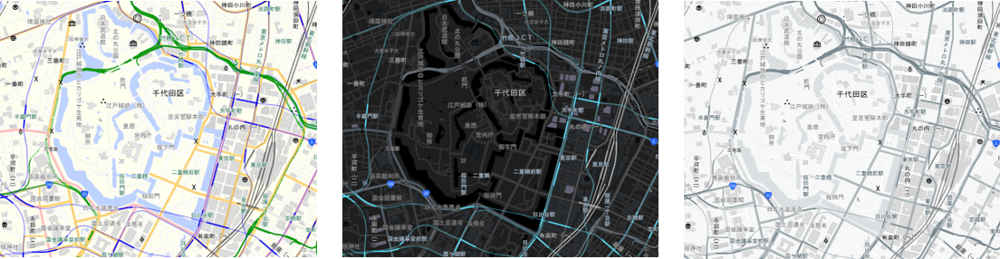

# styling-tools-for-gsi-optbv
地理院の最適化ベクトルタイルのスタイリング用のツール

[最適化ベクトルタイル](https://github.com/gsi-cyberjapan/optimal_bvmap)のスタイリング用ツールです。
上記レポジトリで公開されている std.json をもとに、オリジナルカラーのスタイルを生成します。

* https://mghs15.github.io/styling-tools-for-gsi-optbv/index.html?style=basic
* https://mghs15.github.io/styling-tools-for-gsi-optbv/index.html?style=dark2
* https://mghs15.github.io/styling-tools-for-gsi-optbv/index.html?style=mono2

以下のレポジトリでの成果をベースにしています（参考文献等もご参照ください）。

* https://github.com/mghs15/simple-style-tools
* https://github.com/mghs15/style-color-change-on-web

## 使い方
1. `makeTemplate.js`でもとになる`std.json`からひな型となる`template.json`を作成する。
  * 地図デザインで使われている色を、地物のカテゴリごとに分類する。
  * 分類した色を文字列として`template.json`に埋め込む（`template.json`そのものをMapbox GL JSで利用できない。）。
  * 一部色以外にも、線の太さ等を変更している。
  * 引数に何らかの文字を渡すと、駅用のレイヤと`fill-extrusion`による建物3Dレイヤを追加する（関連する調整あり）。
2. `convert.js`で`template.json`の文字列を使いたい配色セットで置き換える。
  * 配色セットは、今のところ、`convert.js` にハードコードされている。
  * 配色セットの中から、どの配色にするかについては、１つ目の引数に渡す。
  * 主な関数は２つ
    * `convertColor()`
      * 文字列（`rgb(r,g,b)`、`hsl(h,s%,l%)`）、キー名の場合：文字列は配列形式（`["rgba", r, g, b, a]` 等）へ変換・キー名の場合はカラーセットから目的の rgb を配列形式を取得→ `changeColor()` に渡す→配列からテキスト形式（`rgba(r,g,b,a)` 等）に変換して返す。
      * 配列：再帰的に処理を行う。最後にとりまとめた結果を配列で返す。
      * その他：そのままの値を返す。
    * `changeColor()`
      * モノクロ系統については、色の変換を行う。
      * `["rgba", r, g, b, a]`、`["hsla", h, "s%", "l%", a]` の配列を返す。
      * 内部的に rgb と hsl の変換が入る。
3. `setup.js`は、スタイル一式を`docs`フォルダへ出力する。
  * どのスタイルを出力するかは、変数`list`にハードコード。

## 変更履歴
### 2023/03/25
* 駅の色用のキー名を追加
* 駅部分の色、道路の枠線の色を変更
